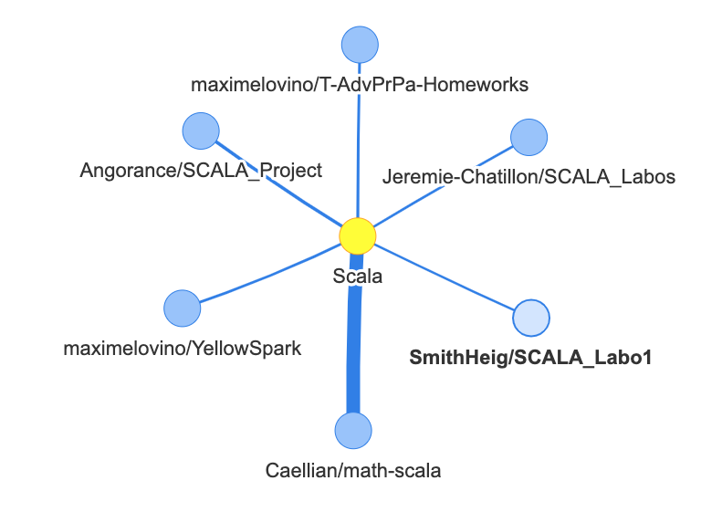

# DevRank

DevRank is a project for a Web Mining class at HES-SO Master. The idea behind DevRank is to analyse the graph of connection between users and repositories on GitHub and apply the centrality algorithm to define the influence of developers on the platform.


## Context and project objectives

The goal of the project is to create a visual search engine for GitHub. The idea is to be able to visualise the graph of GitHub connections between users, repositories and programming languages. Then, we shall run a centrality algorithm in order to find the most influent developers on the platform, by using the weighted connections according to contributions count to projects. We will also try to detect clusters and closed communities as well as compute shortest paths between users.

## Data

We are using the [GitHub GraphQL API](https://developer.github.com/v4/) to retrieve GitHub users and repositories information by starting from a given seed user and then looking at repositories they contribute to in order to find more users and continue exploring the graph of connections. For repositories, the top 3 languages from each repository are retrieved.

### Storage of the information retrieved

The brain behind our platform will be a graph database, [Neo4J](https://neo4j.com/). All information retrieved and computed will be stored in the database with the following structure:


### Nodes types

We have 3 types of Nodes:

- `User` which contains the `login` of the user, the `centrality` field with the computed centrality value and the `partition` field containing the ID of the partition for the user
- `Repo` which contains the `name` of the repository, in this case the full name with `<owner>/<name>`
- `Language` which contains the `name` of the language

All three have unique constraints applied to their "primary keys".

### Relations types

We have 4 types of Relations:  two direct Relations and two Relations that are built from other Relations.

The direct ones are:

- `CONTAINS` which links a repository with the language contained in the repository, it includes `size` which is the number of bytes of code in the reposity in that language
- `CONTRIBUTES` which links a user to a repository, it includes `count` which is the number of contributions from the user in the repository

These relations are unique and as such, we use a merge technique so that if we run the program a second time with another seed user for example and a field value as changed, for example the number of contributions, we update the existing one with the new value instead of recreating a new Relation. To do so, the query for example is the following between user and repository:

```cypher
MATCH (user:User{login:'<user>'}),(repo:Repo{name:'<repo>'})
MERGE (user)-[r:CONTRIBUTES]->(repo)
	ON CREATE SET r.count = <contributions_count>
	ON MATCH SET r.count = <contributions_count>
return r
```

The Relations built from the others are:

- `KNOWS` which is a directed relation between two users who have one or more repositories  in common, the `size` field of the Relation from u1->u2 is the sum of the number of contributions made by u2 to the common projects and the `size` of the Relation between from u2->u1 is the sum of the number of contributions made by u1 to the common projects.
- `CODES_IN` which links a user to the languages contained in repositories he contributes to. The `size` field of the relation is the sum of the number of contributions made by the user in repositories containing the language.

### APOC for creating relations

In order to apply operations on the whole graph once all nodes and direct relations are inserted, we need to use the [APOC](https://github.com/neo4j-contrib/neo4j-apoc-procedures) library in order to create procedures that will mange our tasks in smaller batches. For example, when creatings `CODES_IN` relations, if we do everything in a simple query, it will fail with an `Out of memory error` or simply freeze  the database. In order to avoid this, we use APOC and the call is the following:

```cypher
CALL apoc.periodic.iterate(
"MATCH (u1:User)-[c:CONTRIBUTES]->()-[:CONTAINS]->(l:Language) RETURN *",
"MERGE (u1)-[r:CODES_IN]->(l) 
    ON CREATE SET r.size = c.count 
    ON MATCH SET r.size = r.size + c.count", 
{batchSize:10000})
YIELD batches, total RETURN batches, total
```

This will create the relations by batches of size 10'000.

### Computing centrality

We use a centrality measure in order to determine the influence of users on the platform. The algorithm is provided in the [Graph Algorithms](https://github.com/neo4j-contrib/neo4j-graph-algorithms) library and is called *Degree Centrality*. We use the outgoing `KNOWS` Relations from users with the weigth from `size` of the Relations:

```cypher
CALL algo.degree("User", "KNOWS", {direction: "outgoing", writeProperty: "centrality", weightProperty: "size"})
```

#### Why we didn't use PageRank

Initially, we planned on using the PageRank algorithm to compute the influcence of users. The problem is that we can have groups of users with all `KNOWS` inside the group and no Relations going outside the group. This is called a *Spider Trap* in the PageRank algorithm and will lead to boost the PageRank of users in that group and take all the importance.

### Finding communities with Strongly Connected Components

We use the [*Strongly Connected Components*](https://neo4j.com/docs/graph-algorithms/current/algorithms/strongly-connected-components/index.html) algorithm to detect clusters in the graph and split the users in communities. We use the `KNOWS` Relations here to determine communities:

```cypher
CALL algo.scc('User','KNOWS', {write:true,partitionProperty:'partition'})
```


### Retrieval process

When running the program, we specify a seed user and the maximum number of hops:

```shell
python create_graph.py <seedUser> <numberOfHops>
```

We start by adding  the `(seed_user,hops)` pair in the `users_to_process` queue. Then hile the `users_to_process` queue is not empty:

1. We take the next user to process from the queue
2. We retrieve the user and its contributions
3. We insert the user in the database
4. For each contribution, we insert the repository, the `CONTRIBUTES` relation between user and repository, the top 3 languages for the repository and the `CONTAINS` relation between the repository and the languages. We then add the repository  in `repos_to_process` queue with `hops - 1`.
5. For all repositories in `repos_to_process`, we retrieve all mentionable users
6. If the number of hops is bigger than 0, we add the `(user,hops)` pair in the `users_to_process` queue. If the number of hops is 0, we add the user in the `orphans_to_process` list.

Once the `users_to_process` queue is empty, we launch threads (from experience, we launch more or less 1.4 * the number of keys we have) and split the `orphans_to_process` list between threads, for each one of those `orphans_to_process`:

1. We retrieve the user and its contributions
2. We insert the user in the database
3. For each contribution, we only insert the `CONTRIBUTES` relation between user and repository if the repository already existed

Finally, once the retrieval of `orphans_to_process` is done, we join the threads and launch the creation of the relations built from other relations.

1. We delete existing `KNOWS`  relations
2. We delete existing `CODES_IN` relations
3. We create all `KNOWS` relations
4. We create all `CODES_IN` relations
5. We compute the centrality for all users.
6. We compute the communities with *Strongly Connected Components*

The relations are deleted here before recreating them because they are build by adding to existing relations, so if they already exist before starting, the results wouldn't be consistent.

## Project planning

As of May 3rd 2019, we had built a first version of our retrieval program taking into account users, repositories and languages, with repositories' contributors taken using the `mentionableUsers` present in the repository object. We now have to improve this program to consider direct contributors to the repository as well as the importance of each contribution.  We also need to build the visualisation and querying frontend for our program.

The steps on the project were the following with suggested deadlines:

- May 10th 2019:
  - New version of the retrieval program with all contributions and their importance
  - Completed planning
- May 17th 2019:
  - Progression on the frontend and visualisations
  - Simple queries
  - Communities detection in the database
- May 31st 2019:
  - Finish the frontend
  - Data retrieval
  - Clean up
- June 10th 2019: Project submission

## Project features and frontend

We have a built a frontend for the application as a simple web page that uses [Neovis.js](https://github.com/neo4j-contrib/neovis.js/) as well as the [Neo4J JavaScript driver](https://github.com/neo4j/neo4j-javascript-driver). The frontend communicates directly with the database. The frontend implementation is contained in the [`/neovis` folder](https://github.com/Matoran/DevRank/tree/master/neovis).

The frontend is composed of 3 sections, we have a main section displaying the result graph for a query, a sidebar allowing us to make different queries using form and a query bar on top that allows to write or modify an existing query and run it.


In the sidebar, we have four sections, each with one or more input fields and buttons:

- *Shortest path* allows us to choose two users and display the shortest path between them
- *User centered information* allows us to choose one user and run different queries around that user
- *Repository* allows us to choose a repository and run different queries around that repository
- *Language* allows us to choose a language and run different queries around that language

Finally, the *View complete graph* on top runs the initial query which  displays the users and the repository with `CONTRIBUTES` Relations. This query is limited to 300 results, because above that Neovis starts to slow down.

All the inputs in the sidebar are implemented with an autocomplete for the specifc field that allows to complete an initial input with a name from the database. In the case of the users and repositories inputs, we have to enter at least 3 characters to trigger the autocomplete, for languages one character is enough. The autocomplete uses the Neo4j JavaScript driver to return matching results for the corresponding types.

### Queries

#### "Full graph" query

Our *full graph* query is loaded at the beginning and consists of the GitHub graph as we imagine it with user, repositories and `CONTRIBUTES` relations only. Only 300 elements are displayed and the query is the following:

```cypher
MATCH p=(:User)-[:CONTRIBUTES]->(:Repo) RETURN p LIMIT 300
```

#### Shortest path between users

In order to find the shortest path between users, we use a query that links users with as many `KNOWS` Relations as needed and calls [`shortestPath`](https://neo4j.com/docs/graph-algorithms/current/algorithms/shortest-path/) :

```cypher
MATCH (u1:User { login: '${user1}' }),(u2:User { login: '${user2}' }), p = shortestPath((u1)-[r:KNOWS *]-(u2)) RETURN p
```

#### User centered queries

To find all "acquaintances", contributions and languages, we can use the following three queries:

```cypher
MATCH (u1:User { login: '${user}' })-[k:KNOWS]->(u2) RETURN *
```

```cypher
MATCH (u1:User { login: '${user}' })-[k:CONTRIBUTES]->(r) RETURN *
```

```cypher
MATCH (u1:User { login: '${user}' })-[k:CODES_IN]->(l) RETURN *
```

If we want to have other users as well for the repositories the user contributes to, we use:

```cypher
MATCH p=(:User{login:'${user}'})-[:CONTRIBUTES]->(r:Repo) MATCH p2=(u2:User)-[]->(r) return p,p2
```

This last query uses two matches to get all repositories the user contributes to and eventual other contributors for those repositories.

#### Repositories centered queries

To display languages and contributors respectively:

```cypher
MATCH (u1:Repo { name: '${repo}' })-[k:CONTAINS]->(l) RETURN *
```

```cypher
MATCH (u1:Repo { name: '${repo}' })<-[k:CONTRIBUTES]-(u) RETURN *
```

#### Languages centered queries

For language queries, we display the top 100, otherwise it can quickly become too big for Neovis.

To display the top repositories, we order by the size of code in that language:

```cypher
MATCH p=((r:Repo)-[c:CONTAINS]->(n:Language{name:'${language}'})) with r,c,p ORDER BY c.size DESC LIMIT 100 RETURN p
```

To display the top users for the language, we also order by the size of code in that language:

```cypher
MATCH p=((u:User)-[c:CODES_IN]->(n:Language{name:'${language}'})) WITH u,c,p ORDER BY c.size DESC LIMIT 100 RETURN p
```

### Neovis configuration

We configured Neovis with the settings according to our schema:

```js
{
	labels: {
		"User": {
			caption: "login",
			size: "centrality",
      community: "partition"
		},
		"Repo": {
			caption: "name"
		},
		"Language": {
			caption: "name"
		},
	},
	relationships: {
		"CONTRIBUTES": {
			caption: false,
			thickness: "count"
		},
		"KNOWS": {
			caption: false,
			thickness: "size"
		},
		"CONTAINS": {
			caption: false,
			thickness: "size"
		},
		"CODES_IN": {
			caption: false,
			thickness: "size"
		}
	}
}
```

This allows to specify thickness of relations according to the `size` or `count` in our case and for users we increase the size according to the centrality value. We also use the `community` field to specify coloring differently according to `partition` of user. We can see the thickness of links for the different repositories here in the top Scala repositories for example:



## Tools used

### Data visualisation

We will use [Neovis.js](https://github.com/neo4j-contrib/neovis.js/) to query the graph from the database and visualise it on a webpage.

### Python retrieval program

The Python retrieval program is written in Python 3 and uses the following main dependencies:

- [Simple GraphQL Client](https://github.com/profusion/sgqlc) : This GraphQL Clients allows us to interact with the GitHub GraphQL API
- [Neo4J Python Driver](https://neo4j.com/developer/python/): To interact with the Neo4J database
- [DotEnv](https://github.com/theskumar/python-dotenv): To load `.env` files to be accessed as environment variables in code

### Database

We use a [Neo4J](https://neo4j.com/) database with the [Graph Algorithms](https://github.com/neo4j-contrib/neo4j-graph-algorithms) and [APOC](https://github.com/neo4j-contrib/neo4j-apoc-procedures) plugins installed. The following constraints must be applied in the database:

```cypher
CREATE CONSTRAINT ON (n:User) ASSERT n.login IS UNIQUE;
CREATE CONSTRAINT ON (n:Repo) ASSERT n.name IS UNIQUE;
CREATE CONSTRAINT ON (n:Language) ASSERT n.name IS UNIQUE;
```

## How to run

To run the project, you will need a Neo4J database server (this can be done through a Docker Image for example) and replace the url of the database in the frontend HTML file and the data retrieval Python program. You will also need to install the Python dependencies defined in the `requirements.txt` file. To do so, you can use:

```
pip install -r requirements.txt
```

 You will also need to enter your DB credentials in the frontend HTML file and create a `.env` file in the Python program folder containing at last:

```
DB_USER=<neo4jUser>
DB_PASS=<neo4jPassword>
GH_KEY0=<API_KEY_GITHUB>
```

You can get a GitHub API key under "Personal access tokens" in GitHub settings. You can add as many GitHub keys as you want, by adding `GH_KEY<index>` entries to the `.env` file, the keys will be used in a round-robin between requests. This is done in order to increase the limits of the number of requests per hour by using multiple keys.

To launch the program, run:

```shell
python create_graph.py <seedUser> <numberOfHops>
```

## Conclusion

We really enjoyed working on this project and exploring GitHub data. We had to find "hacky" solutions like the round robin of keys to increase limits and we love having to do that. We reached all the objectives we set for the project and even developed a more complete frontend than we hoped in the beginning.